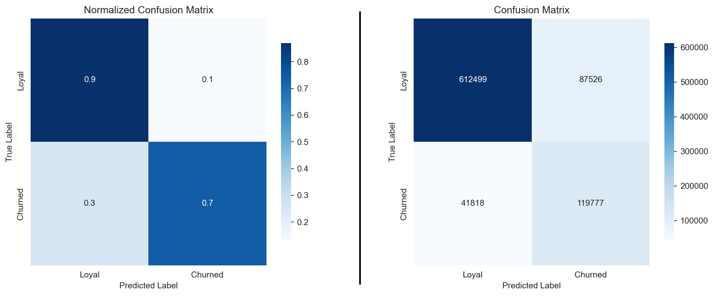
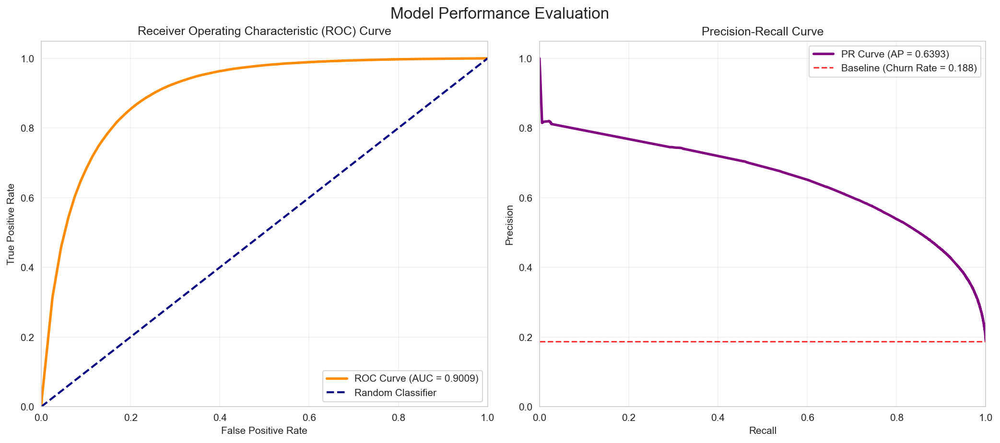
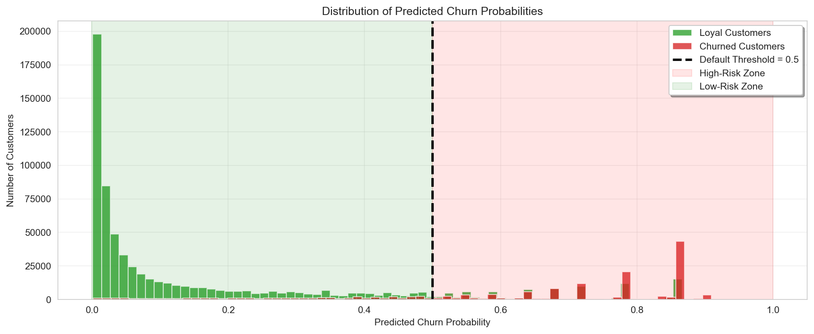
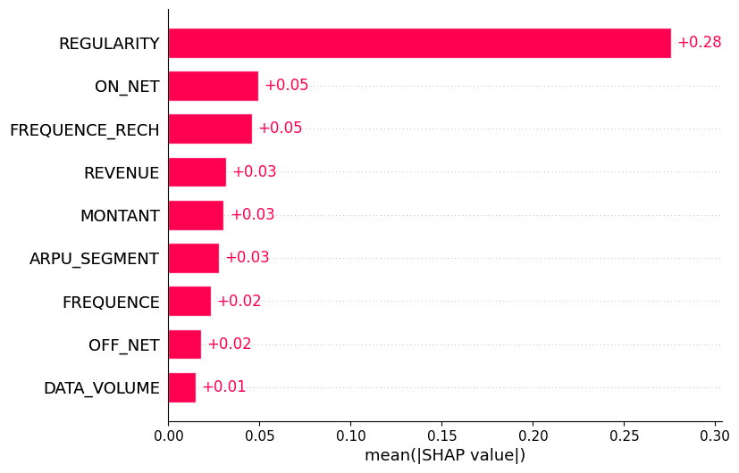
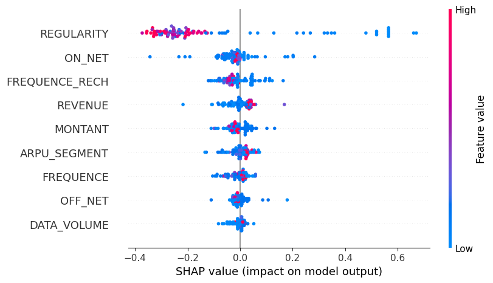

# Customer churn prediction in telecom industry

<div align="center">


</div>

This repository contains the official, fully reproducible implementation and source code related to the referenced research paper on customer churn prediction in the telecommunications industry.

## 📃 Referenced Paper

The methodology and results implemented here are based on the following peer-reviewed publication:

| Detail | Description |
| :--- | :--- |
| **Title** | A Data-driven Approach with Explainable AI for Customer Churn Prediction |
| **Authors** | Daniyal Asif, Muhammad Shoaib Arif, Aiman Mukheimer |
| **Journal** | Results in Engineering, Volume 26 (2025) |
| **DOI (Official Link)** | [https://doi.org/10.1016/j.rineng.2025.104629](https://doi.org/10.1016/j.rineng.2025.104629) |
| **Dataset** | https://zindi.africa/competitions/expresso-churn-prediction/data |


## 💡 Critical Correction: Fixing Data Leakage

This project successfully addressed a major flaw in the original methodology: **Data Leakage** during the train-test split.

The problem was that transformations like **Imputation**, **Feature Engineering**, and **Scaling** were applied *before* the data was split, causing information from the test set to leak into the training process.

* **Solution:** The preprocessing pipeline was reordered to **Split first**, then apply all transformations **separately** to the training and test sets.
* **Result:** This ensures the evaluation metrics below are **true**, reflecting the model's performance on unseen data.


## 🤖 Core Model: XAI-Churn TriBoost Ensemble

The central model, **XAI-Churn TriBoost**, is a powerful ensemble classifier designed to maximize predictive performance while remaining transparent for XAI analysis.

| Component | Description |
| :--- | :--- |
| **Model Type** | Soft Voting Ensemble |
| **Base Estimators** | XGBoost, CatBoost, and LightGBM |
| **Objective** | Combines the strengths of three leading Gradient Boosting Machines (GBMs) by taking a weighted average of their predicted probabilities. (Weights are determined during optimization). |
| **Key Preprocessing** | Data Cleaning, Iterative Imputation, Sequential Scaling (Robust → Standard → MinMax), Feature Engineering, Boruta-based Feature Selection, and **SMOTE** oversampling on the training set. |


## 🚀 Performance Highlights

The following metrics reflect the **realistic performance** of the **XAI-Churn TriBoost Ensemble** after correcting the critical data leakage issue present in the original paper's implementation.


The **XAI-Churn TriBoost Ensemble** is a weighted soft voting ensemble combining XGBoost, CatBoost, and LightGBM. The key performance metrics achieved are:

| Metric | Result |
| :--- | :--- |
| **Accuracy** | $84.99\%$ |
| **Precision** | $57.78\%$ |
| **Recall (Sensitivity)** | $74.12\%$ |
| **F1-Score** | $64.94\%$ |

### Confusion Matrix


### Model Performance Plot



### Predicted Probability Distribution


### SHAP Analysis




## 💡 Explainable AI (XAI) Analysis

This notebook presents a complete end-to-end workflow for evaluating and interpreting the XAI-Churn TriBoost customer churn prediction model using Explainable AI (XAI) techniques.

| Technique | Focus | Purpose |
| :--- | :--- | :--- |
| **LIME** | **Local Interpretability** | Provides a localized, human-readable explanation for an **individual customer's** prediction. The analysis highlights the exact features that contributed positively or negatively to a “No Churn” prediction, helping to understand the model’s reasoning at the single-instance level and support case-by-case decisions. |
| **SHAP** | **Global Interpretability** | Offers global interpretability by quantifying each feature’s contribution across the entire dataset. Using beeswarm and bar plots, SHAP reveals the magnitude and direction of feature impacts, identifies primary drivers of churn risk, uncovers patterns in customer behavior, and validates whether model decisions align with domain knowledge. |

Together, these complementary XAI techniques demonstrate that the model performs well and that its decision-making process is transparent, traceable, and aligned with business expectations. This interpretability strengthens trust in the model and provides actionable insights for customer retention strategies.

## 📂 Repository Structure

```
├── main.py                     # Executes the full pipeline.
├── config.py                   # File paths and environment variables.
├── data/                       # Dataset files.
│   ├── raw/                    # Raw dataset files.
│   └── processed/              # Processed CSV files.
├── src/                        # Source code for model.
│   ├── model.py                # TriBoost ensemble definition.
│   ├── preprocessing.py        # Preprocessing pipeline.
│   └── train.py                # Model training and saving utilities.
├── models/                     # Trained model file.
├── notebooks/                  # Analysis and reports.
│   ├── exploratory_data_analysis.ipynb  # EDA on raw dataset.
│   ├── model_evaluation_report.ipynb    # Performance analysis.
│   └── xai_analysis.ipynb        # LIME and SHAP interpretability.
├── README.md
├── .gitignore
└── requirements.txt
```


## 🛠️ Setup and Installation

### Prerequisites

* Python 3.8+

### Steps

1.  **Clone the repository:**
    ```bash
    git clone https://github.com/BraveVahid/telecom-customer-churn-prediction.git
    cd telecom-customer-churn-prediction
    ```

2.  **Create and activate a virtual environment:**
    ```bash
    python -m venv venv
    source venv/bin/activate  # On Linux/macOS
    venv\Scripts\activate   # On Windows
    ```

3.  **Install dependencies:**
    The project relies on the specific versions listed in `requirements.txt` to ensure full reproducibility.
    ```bash
    pip install -r requirements.txt
    ```

4.  **Data Configuration:**
    The `config.py` file requires environment variables for data paths. Create a `.env` file in the project root and specify the path to your dataset (e.g., `DATASET_PATH=data/telecom_churn_data.csv`).

5.  **Run the Pipeline:**
    Execute the main script to run the entire pipeline: preprocessing, feature selection, data balancing, and TriBoost model training.
    ```bash
    python main.py
    ```
    *Note: Training the ensemble may take some time.*

6.  **Analyze Results:**
    Load the generated notebooks (`model_evaluation_report.ipynb` and `xai_analysis.ipynb`) in a Jupyter environment to review the detailed performance metrics, visualizations, and interpretability insights.

## **👨‍💻 Author**

#### Vahid Siyami
- GitHub: [@BraveVahid](https://github.com/BraveVahid)
- Email: [vahidsiyami](vahidsiyami.dev@gmail.com)
- Telegram: [@BraveVahid](https://t.me/BraveVahid)
