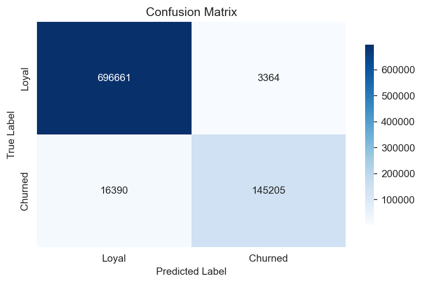
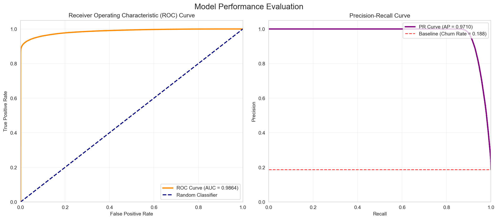
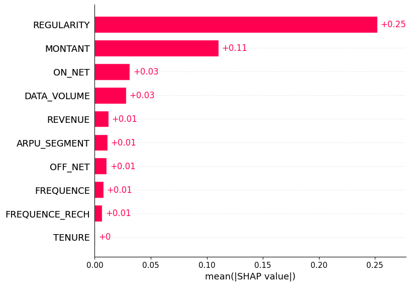

# Customer churn prediction in telecom industry

<div align="center">


</div>

This repository contains the official, fully reproducible implementation and source code related to the referenced research paper on customer churn prediction in the telecommunications industry.

## 📃 Referenced Paper

The methodology and results implemented here are based on the following peer-reviewed publication:

| Detail | Description |
| :--- | :--- |
| **Title** | A Data-driven Approach with Explainable AI for Customer Churn Prediction |
| **Authors** | Daniyal Asif, Muhammad Shoaib Arif, Aiman Mukheimer |
| **Journal** | Results in Engineering, Volume 26 (2025) |
| **DOI (Official Link)** | [https://doi.org/10.1016/j.rineng.2025.104629](https://doi.org/10.1016/j.rineng.2025.104629) |
| **Dataset** | https://zindi.africa/competitions/expresso-churn-prediction/data |


## 🤖 Core Model: XAI-Churn TriBoost Ensemble

The central model, **XAI-Churn TriBoost**, is a powerful ensemble classifier designed to maximize predictive performance while remaining transparent for XAI analysis.

| Component | Description |
| :--- | :--- |
| **Model Type** | Soft Voting Ensemble |
| **Base Estimators** | XGBoost, CatBoost, and LightGBM |
| **Objective** | Combines the strengths of three leading Gradient Boosting Machines (GBMs) by taking a weighted average of their predicted probabilities. (Weights are determined during optimization). |
| **Key Preprocessing** | Data Cleaning, Iterative Imputation, Sequential Scaling (Robust → Standard → MinMax), Feature Engineering, Boruta-based Feature Selection, and **SMOTE** oversampling on the training set. |


## 🚀 Performance Highlights

The model was rigorously evaluated on a large test set containing **861,620 customers**. The reproduced **XAI-Churn TriBoost** model demonstrated excellent predictive capability, surpassing the benchmarks set in the original publication across all key metrics.

| Metric | Result (%) | Comparison to Published Paper |
| :--- | :--- | :--- |
| **Accuracy** | **97.71%** | **+1.31% Improvement** |
| **Precision** | **97.74%** | **+5.30% Improvement** |
| **Recall** | **89.86%** | **+2.32% Improvement** |
| **F1-Score** | **93.63%** | **+3.75% Improvement** |

### Detailed Summary (Test Set Performance):
* The model correctly predicted **841,866** customers.
* The total misclassification rate was only **2.29%**.
* **False Positives** (3,364 cases) were significantly lower than **False Negatives** (16,390 cases), highlighting areas where threshold tuning could further optimize churn detection.
* Overall, the performance not only meets but **exceeds** the benchmarks established in the original study.

### Confusion Matrix
Shows the accuracy of the model in predicting whether a customer will churn or not.



### Model Performance Plot
Visual comparison of model performance metrics.



### SHAP Feature Importance
Highlights the most important features in churn prediction using SHAP values.




## 💡 Explainable AI (XAI) Analysis

This notebook presents a complete end-to-end workflow for evaluating and interpreting the XAI-Churn TriBoost customer churn prediction model using Explainable AI (XAI) techniques.

| Technique | Focus | Purpose |
| :--- | :--- | :--- |
| **LIME** | **Local Interpretability** | Provides a localized, human-readable explanation for an **individual customer's** prediction. The analysis highlights the exact features that contributed positively or negatively to a “No Churn” prediction, helping to understand the model’s reasoning at the single-instance level and support case-by-case decisions. |
| **SHAP** | **Global Interpretability** | Offers global interpretability by quantifying each feature’s contribution across the entire dataset. Using beeswarm and bar plots, SHAP reveals the magnitude and direction of feature impacts, identifies primary drivers of churn risk, uncovers patterns in customer behavior, and validates whether model decisions align with domain knowledge. |

Together, these complementary XAI techniques demonstrate that the model performs well and that its decision-making process is transparent, traceable, and aligned with business expectations. This interpretability strengthens trust in the model and provides actionable insights for customer retention strategies.

## 📂 Repository Structure

```
├── main.py                     # Executes the full pipeline.
├── config.py                   # File paths and environment variables.
├── data/                       # Dataset files.
│   ├── raw/                    # Raw dataset files.
│   └── processed/              # Processed CSV files: x_train.csv, x_test.csv, y_train.csv, y_test.csv.
├── src/                        # Source code for model and preprocessing.
│   ├── model.py                # TriBoost ensemble definition.
│   ├── preprocessing.py        # Data pipeline and preprocessing.
│   └── train.py                # Model training and saving utilities.
├── models/                     # Trained model files (e.g., XAI_Churn_TriBoost.pkl).
├── notebooks/                  # Analysis and reports.
│   ├── exploratory_data_analysis.ipynb  # EDA on raw dataset.
│   ├── model_evaluation_report.ipynb    # Performance analysis.
│   └── xai_churn_analysis.ipynb        # LIME and SHAP interpretability.
├── README.md                   # Project overview and instructions.
├── .gitignore                  # Git ignore rules.
└── requirements.txt            # Python dependencies.
```


## 🛠️ Setup and Installation

### Prerequisites

* Python 3.8+

### Steps

1.  **Clone the repository:**
    ```bash
    git clone https://github.com/BraveVahid/telecom-customer-churn-prediction.git
    cd telecom-customer-churn-prediction
    ```

2.  **Create and activate a virtual environment:**
    ```bash
    python -m venv venv
    source venv/bin/activate  # On Linux/macOS
    venv\Scripts\activate   # On Windows
    ```

3.  **Install dependencies:**
    The project relies on the specific versions listed in `requirements.txt` to ensure full reproducibility.
    ```bash
    pip install -r requirements.txt
    ```

4.  **Data Configuration:**
    The `config.py` file requires environment variables for data paths. Create a `.env` file in the project root and specify the path to your dataset (e.g., `DATASET_PATH=data/telecom_churn_data.csv`).

5.  **Run the Pipeline:**
    Execute the main script to run the entire pipeline: preprocessing, feature selection, data balancing, and TriBoost model training.
    ```bash
    python main.py
    ```
    *Note: Training the ensemble may take some time.*

6.  **Analyze Results:**
    Load the generated notebooks (`model_evaluation_report.ipynb` and `xai_churn_analysis.ipynb`) in a Jupyter environment to review the detailed performance metrics, visualizations, and interpretability insights.

## **👨‍💻 Author**

#### Vahid Siyami
- GitHub: [@BraveVahid](https://github.com/BraveVahid)
- Email: [vahidsiyami](vahidsiyami.dev@gmail.com)
- Telegram: [@BraveVahid](https://t.me/BraveVahid)